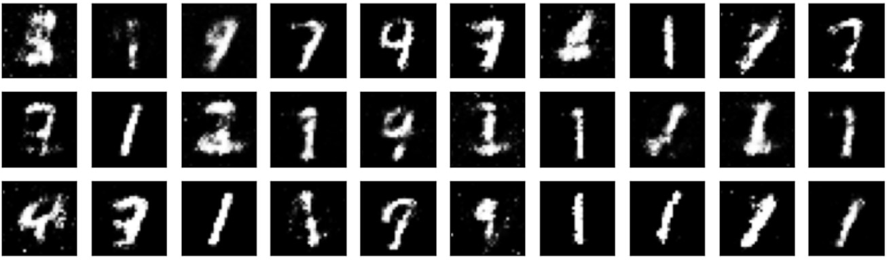
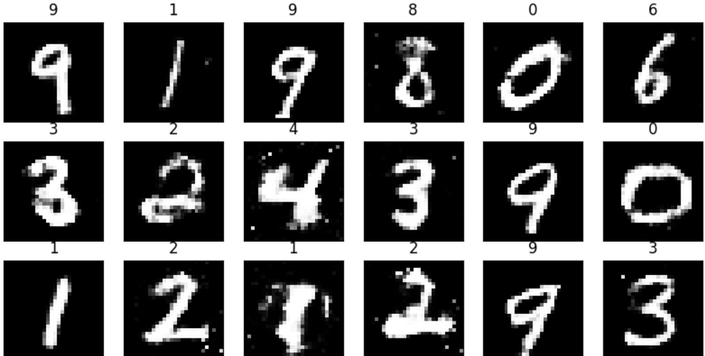

# GAN_Pytorch
Generative adversarial network (GAN) are well-known deep generative models proposed by Ian Goodfellow that could be used for synthesising data. It consists of two components, a generator (G) network that learns the data distribution and generates new examples and a discriminator (D) network that distinguishes between real and fake examples i.e. examples generated by G. 

In this repository, I will show you the implementation of a series of tasks related to GANs using MNIST / Fashion-MNIST datasets.

## 1. Implementation of GANs using standard fully connected neural network on MNIST
Go through the NN_GAN.ipynb file and play with the implementaion of wonderful generative network.
As the file is commented appropiately, you could easily follow through the implementation.

Results after training :

## 2. Implementation of Conditional GANs using CNN based networks on MNIST
Go through the Conditional_GAN.ipynb file and play with the implementaion of wonderful generative network.
As the file is commented appropiately, you could easily follow through the implementation. 

Results after training :

